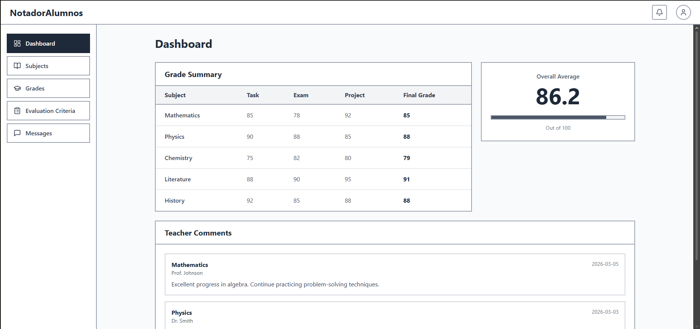

# Proyecto Web: NotadorAlumnos - ODS 4

Este proyecto es una propuesta tecnológica para mejorar la calidad educativa (ODS 4) desde la perspectiva del Desarrollo de Aplicaciones Web (DAW).

## 1. Análisis del Problema y Sostenibilidad (Responsable: Alumno A)

### El "Bug" Educativo

> Actualmente existe un problema en la gestión de las notas para los alumnos. Las calificaciones de tareas, exámenes y proyectos están repartidas por diferentes apartados dentro del Moodle del curso, lo que hace difícil consultarlas de forma rápida y clara.
>
> Esto provoca confusión a la hora de revisar las notas o calcular la media de la asignatura. Además, muchas veces los comentarios del profesor o los criterios de evaluación no se encuentran fácilmente.
>
> Nuestra aplicación busca solucionar este problema creando una plataforma donde los profesores puedan subir las notas de los alumnos de forma organizada y donde el alumnado pueda consultarlas en cualquier momento desde un único panel.

### Nuestro "Parche" Sostenible

- [ ] Interfaz ligera optimizada para cargar rápido y consumir pocos datos.
- [ ] Diseño accesible compatible con lectores de pantalla para mejorar la inclusión.
- [ ] Panel centralizado de notas que reduce el tiempo necesario para buscar información académica.

## 2. Arquitectura de la Solución Web (Responsable: Alumno B)

### Funcionalidades Principales

1. **Gestión de notas por profesores:** Los profesores pueden subir notas de exámenes, tareas y proyectos para cada alumno.
2. **Panel de notas para alumnos:** Los estudiantes pueden consultar todas sus calificaciones organizadas por asignatura.
3. **Cálculo automático de medias:** La aplicación calcula la media de cada asignatura y muestra comentarios o criterios de evaluación del profesor.

### Entidades de Datos Básicas

| Entidad | Descripción | Ejemplo de datos |
| :--- | :--- | :--- |
| Usuarios | Personas registradas en la plataforma (profesores y alumnos) | ID, nombre, email, contraseña, rol |
| Notas | Calificaciones de cada actividad | ID_nota, ID_alumno, ID_asignatura, nota, comentario |
| Asignaturas | Información de cada asignatura | ID_asignatura, nombre, profesor |

### Prototipo de Interfaz (Frontend)

A continuación se muestra el prototipo de nuestra aplicación:

**Breve explicación:**  
La interfaz muestra un panel donde el alumno puede ver todas sus asignaturas y las notas correspondientes a cada actividad. También se visualiza la nota media y los comentarios del profesor.

